# Exploratory Data Analysis

```{r, echo=FALSE}
knitr::opts_chunk$set(python.reticulate = TRUE)
library(reticulate)
library(ggplot2)
library(vegawidget)
use_python("usr/local/bin/python3")
```

## Introduction

This chapter will show you how to use visualisation and transformation to explore your data in a systematic way, a task that statisticians call exploratory data analysis, or EDA for short. EDA is an iterative cycle. You:

1. Generate questions about your data.

1. Search for answers by visualising, transforming, and modelling your data.

1. Use what you learn to refine your questions and/or generate new questions.

EDA is not a formal process with a strict set of rules. More than anything, EDA is a state of mind. During the initial phases of EDA you should feel free to investigate every idea that occurs to you. Some of these ideas will pan out, and some will be dead ends. As your exploration continues, you will home in on a few particularly productive areas that you'll eventually write up and communicate to others.

EDA is an important part of any data analysis, even if the questions are handed to you on a platter, because you always need to investigate the quality of your data. Data cleaning is just one application of EDA: you ask questions about whether your data meets your expectations or not. To do data cleaning, you'll need to deploy all the tools of EDA: visualisation, transformation, and modelling.

### Prerequisites

In this chapter we'll combine what you've learned about pandas and Altair to interactively ask questions, answer them with data, and then ask new questions.

```{python setup, message = FALSE, cache = FALSE}
import pandas as pd
import altair as alt
import numpy as np
from scipy import stats

alt.data_transformers.enable('json')

```

Then make sure you have the diamonds data loaded.

```{python, cache=FALSE}

diamonds = pd.read_csv("https://github.com/byuidatascience/data4python4ds/raw/master/data-raw/diamonds/diamonds.csv")

diamonds['cut'] = pd.Categorical(diamonds.cut, 
  ordered = True, 
  categories =  ["Fair", "Good", "Very Good", "Premium", "Ideal" ])

diamonds['color'] = pd.Categorical(diamonds.color, 
  ordered = True, 
  categories =  ["D", "E", "F", "G", "H", "I", "J"])


diamonds['clarity'] = pd.Categorical(diamonds.clarity, 
  ordered = True, 
  categories =  ["I1", "SI2", "SI1", "VS2", "VS1", "VVS2", "VVS1", "IF"])


```

## Questions

> "There are no routine statistical questions, only questionable statistical
> routines." --- Sir David Cox

> "Far better an approximate answer to the right question, which is often
> vague, than an exact answer to the wrong question, which can always be made
> precise." --- John Tukey

Your goal during EDA is to develop an understanding of your data. The easiest way to do this is to use questions as tools to guide your investigation. When you ask a question, the question focuses your attention on a specific part of your dataset and helps you decide which graphs, models, or transformations to make.

EDA is fundamentally a creative process. And like most creative processes, the key to asking _quality_ questions is to generate a large _quantity_ of questions. It is difficult to ask revealing questions at the start of your analysis because you do not know what insights are contained in your dataset. On the other hand, each new question that you ask will expose you to a new aspect of your data and increase your chance of making a discovery. You can quickly drill down into the most interesting parts of your data---and develop a set of thought-provoking questions---if you follow up each question with a new question based on what you find.

There is no rule about which questions you should ask to guide your research. However, two types of questions will always be useful for making discoveries within your data. You can loosely word these questions as:

1. What type of variation occurs within my variables?

1. What type of covariation occurs between my variables?

The rest of this chapter will look at these two questions. I'll explain what variation and covariation are, and I'll show you several ways to answer each question. To make the discussion easier, let's define some terms:

*   A __variable__ is a quantity, quality, or property that you can measure.

*   A __value__ is the state of a variable when you measure it. The value of a
    variable may change from measurement to measurement.

*   An __observation__ is a set of measurements made under similar conditions
    (you usually make all of the measurements in an observation at the same
    time and on the same object). An observation will contain several values,
    each associated with a different variable. I'll sometimes refer to
    an observation as a data point.

*   __Tabular data__ is a set of values, each associated with a variable and an
    observation. Tabular data is _tidy_ if each value is placed in its own
    "cell", each variable in its own column, and each observation in its own
    row.

So far, all of the data that you've seen has been tidy. In real-life, most data isn't tidy, so we'll come back to these ideas again in [tidy data].

## Variation

**Variation** is the tendency of the values of a variable to change from measurement to measurement. You can see variation easily in real life; if you measure any continuous variable twice, you will get two different results. This is true even if you measure quantities that are constant, like the speed of light. Each of your measurements will include a small amount of error that varies from measurement to measurement. Categorical variables can also vary if you measure across different subjects (e.g. the eye colors of different people), or different times (e.g. the energy levels of an electron at different moments).
Every variable has its own pattern of variation, which can reveal interesting information. The best way to understand that pattern is to visualise the distribution of the variable's values.

### Visualising distributions

How you visualise the distribution of a variable will depend on whether the variable is categorical or continuous. A variable is **categorical** if it can only take one of a small set of values. In Python, categorical variables are usually saved as Category or object datatypes. To examine the distribution of a categorical variable, use a bar chart:

We want the height of the bars to display how many observations occurred with each x value. You can compute these values with `size()`:

```{python, cache = FALSE}
chart_dat = (diamonds.
              groupby('cut').
              agg(count = ('carat', 'size')).
              reset_index())
```


```{python, cache = FALSE}
chart = (alt.Chart(chart_dat).
    encode(
        x = 'cut',
        y = 'count'
    ).
    mark_bar().
    properties(width = 400)
)

chart.save("screenshots/altair_diamonds_barchart.png")

```

```{R, echo=FALSE, fig.align="left"}

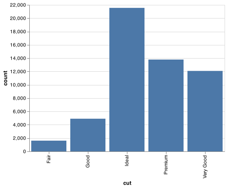

```

A variable is **continuous** if it can take any of an infinite set of ordered values. Numbers and date-times are two examples of continuous variables. To examine the distribution of a continuous variable, use a histogram:

```{python, cache = FALSE}
chart = (alt.Chart(diamonds).
    encode(
        x = alt.X('carat', bin = alt.Bin(step = 0.5)), 
        y = 'count()').
        mark_bar()
)

chart.save("screenshots/altair_diamonds_hist_bin.png")

```

```{R, echo=FALSE, fig.align="left"}

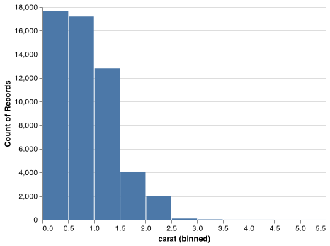

```


A histogram divides the x-axis into equally spaced bins and then uses the height of a bar to display the number of observations that fall in each bin. In the graph above, the tallest bar shows that almost 30,000 observations have a `carat` value between 0.25 and 0.75, which are the left and right edges of the bar.

You can set the width of the intervals in a histogram with the `alt.Bin()` and the `step` argument, which is measured in the units of the `x` variable. You should always explore a variety of binwidths when working with histograms, as different binwidths can reveal different patterns. For example, here is how the graph above looks when we zoom into just the diamonds with a size of less than three carats and choose a smaller binwidth.

```{python, cache = FALSE}
smaller = diamonds.query('carat < 3')

chart = (alt.Chart(smaller).
    encode(
        x = alt.X('carat', bin = alt.Bin(step = 0.1)), 
        y = 'count()').
        mark_bar()
)

chart.save("screenshots/altair_diamonds_hist_smallbin.png")

```

```{R, echo=FALSE, fig.align="left"}

knitr::include_graphics("screenshots/altair_diamonds_hist_smallbin.png")

```


If you wish to see multiple histograms, Altair doesn't have a straightforward way to overly histograms. We recommend using `facet()`. `facet()` performs the same calculation for each group within the facet varaible.

```{python}
chart = (alt.Chart(smaller).
    encode(
        x = alt.X('carat', bin = alt.Bin(step = 0.1)), 
        y = 'count()',
        color = 'cut').
        mark_bar().
        facet(facet = 'cut', columns = 2)
)

chart.save("screenshots/altair_diamonds_facet_hist.png")

```

```{R, echo=FALSE, fig.align="left"}

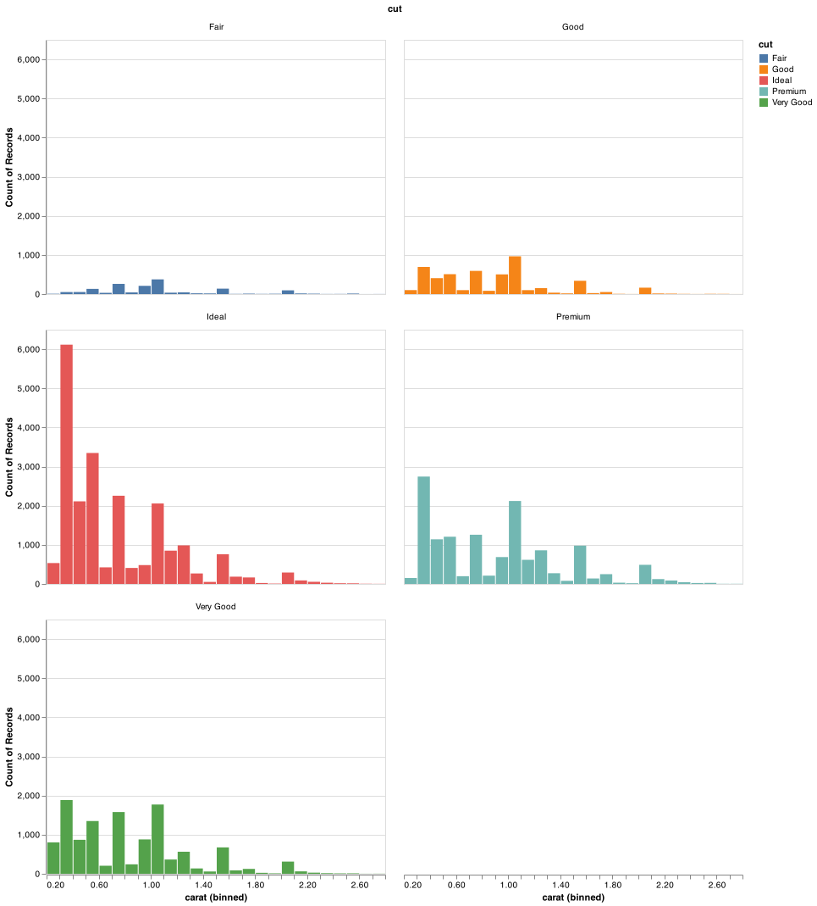

```

There are a few challenges with this type of plot, which we will come back to in [visualising a categorical and a continuous variable](#cat-cont).

Now that you can visualise variation, what should you look for in your plots? And what type of follow-up questions should you ask? I've put together a list below of the most useful types of information that you will find in your graphs, along with some follow-up questions for each type of information. The key to asking good follow-up questions will be to rely on your curiosity (What do you want to learn more about?) as well as your skepticism (How could this be misleading?).

### Typical values

In both bar charts and histograms, tall bars show the common values of a variable, and shorter bars show less-common values. Places that do not have bars reveal values that were not seen in your data. To turn this information into useful questions, look for anything unexpected:

* Which values are the most common? Why?

* Which values are rare? Why? Does that match your expectations?

* Can you see any unusual patterns? What might explain them?

As an example, the histogram below suggests several interesting questions:

* Why are there more diamonds at whole carats and common fractions of carats?

* Why are there more diamonds slightly to the right of each peak than there
  are slightly to the left of each peak?

* Why are there no diamonds bigger than 3 carats?

```{python}
chart = (alt.Chart(smaller).
    encode(
        x = alt.X('carat', bin = alt.Bin(step = 0.01)), 
        y = 'count()').
        mark_bar()
)

chart.save("screenshots/altair_diamonds_hist_smallestbin.png")

```

```{R, echo=FALSE, fig.align="left"}

knitr::include_graphics("screenshots/altair_diamonds_hist_smallestbin.png")

```


Clusters of similar values suggest that subgroups exist in your data. To understand the subgroups, ask:

* How are the observations within each cluster similar to each other?

* How are the observations in separate clusters different from each other?

* How can you explain or describe the clusters?

* Why might the appearance of clusters be misleading?

The histogram below shows the length (in minutes) of 272 eruptions of the Old Faithful Geyser in Yellowstone National Park. Eruption times appear to be clustered into two groups: there are short eruptions (of around 2 minutes) and long eruptions (4-5 minutes), but little in between.

```{python, cache = FALSE}
faithful = pd.read_csv("https://github.com/byuidatascience/data4python4ds/raw/master/data-raw/faithful/faithful.csv")

chart = (alt.Chart(faithful).
    encode(
        x = alt.X('eruptions', bin = alt.Bin(step = 0.25)), 
        y = 'count()').
        mark_bar()
)

chart.save("screenshots/altair_faithful_hist.png")
```

```{R, echo=FALSE, fig.align="left"}

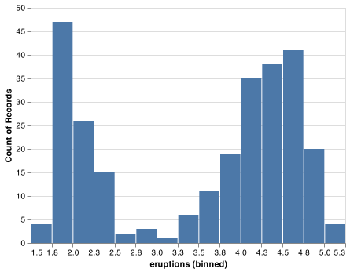

```

Many of the questions above will prompt you to explore a relationship *between* variables, for example, to see if the values of one variable can explain the behavior of another variable. We'll get to that shortly.

### Unusual values

Outliers are observations that are unusual; data points that don't seem to fit the pattern. Sometimes outliers are data entry errors; other times outliers suggest important new science. When you have a lot of data, outliers are sometimes difficult to see in a histogram.  For example, take the distribution of the `y` variable from the diamonds dataset. The only evidence of outliers is the unusually wide limits on the x-axis.

```{python}
chart = (alt.Chart(diamonds).
    encode(
        x = alt.X('y', bin = alt.Bin(step = 0.5)), 
        y = 'count()').
        mark_bar()
)

chart.save("screenshots/altair_diamonds_y_hist.png")
```

```{R, echo=FALSE, fig.align="left"}

knitr::include_graphics("screenshots/altair_diamonds_y_hist.png")

```

There are so many observations in the common bins that the rare bins are so short that you can't see them (although maybe if you stare intently at 0 you'll spot something). To make it easy to see the unusual values, we need to zoom to small values of the y-axis with `alt.Scale()` and the argument `clip` set to `True` within `mark_bar()` (note that [Altair has other axis options](https://altair-viz.github.io/user_guide/customization.html#adjusting-axis-limits)):

```{python}
chart = (alt.Chart(diamonds).
    encode(
        x = alt.X('y', bin = alt.Bin(step = 0.5)), 
        y = alt.Y('count()', scale = alt.Scale(domain = (0, 50)))).
        mark_bar(clip = True)
)

chart.save("screenshots/altair_diamonds_y_hist_domain.png")
```

```{R, echo=FALSE, fig.align="left"}

knitr::include_graphics("screenshots/altair_diamonds_y_hist_domain.png")

```

(`alt.Scale()` can be used within `alt.Y()` and `alt.X()` for zooming on either axis. Altair also has a `clamp` argument that functions that work slightly differently: it stacks all the data right at the limits. But it does not work with `mark_bar()`)

This allows us to see that there are three unusual values: 0, ~30, and ~60. We pluck them out with dplyr:

```{python}
unusual = (diamonds.
            query('y < 3 | y > 20').
            filter(['price', 'x', 'y', 'z']).
            sort_values('y')
          )
unusual
```

The `y` variable measures one of the three dimensions of these diamonds, in mm. We know that diamonds can't have a width of 0mm, so these values must be incorrect. We might also suspect that measurements of 32mm and 59mm are implausible: those diamonds are over an inch long, but don't cost hundreds of thousands of dollars!

It's good practice to repeat your analysis with and without the outliers. If they have minimal effect on the results, and you can't figure out why they're there, it's reasonable to replace them with missing values, and move on. However, if they have a substantial effect on your results, you shouldn't drop them without justification. You'll need to figure out what caused them (e.g. a data entry error) and disclose that you removed them in your write-up.


### Exercises

1.  Explore the distribution of each of the `x`, `y`, and `z` variables
    in `diamonds`. What do you learn? Think about a diamond and how you
    might decide which dimension is the length, width, and depth.

1.  Explore the distribution of `price`. Do you discover anything unusual
    or surprising? (Hint: Carefully think about the `step` or the binwidth and make sure
    you try a wide range of values.)

1.  How many diamonds are 0.99 carat? How many are 1 carat? What
    do you think is the cause of the difference?

## Missing values

If you've encountered unusual values in your dataset, and simply want to move on to the rest of your analysis, you have two options.

1.  Drop the entire row with the strange values:

    ```{python, eval = FALSE}
    diamonds2 = diamonds.query('3 <= y <= 20')
    ```

    I don't recommend this option because just because one measurement
    is invalid, doesn't mean all the measurements are. Additionally, if you
    have low quality data, by time that you've applied this approach to every
    variable you might find that you don't have any data left!

1.  Instead, I recommend replacing the unusual values with missing values.
    The easiest way to do this is to use `assign()` to replace the variable
    with a modified copy. You can use the `np.where()` function to replace
    unusual values with `np.nan`:

    ```{python, cache=FALSE}
    diamonds2 = diamonds.assign(
            y = lambda x: np.where((x.y < 3) | (x.y > 20), np.nan, x.y)
            )
    ```

`np.where()` has three arguments. The first argument `condition` should be a logical vector. The result will contain the value of the second argument, `yes`, when `condition` is `True`, and the value of the third argument, `no`, when it is `False`. 

Altair has two ways to handled missing values, `np.nan`. It's not obvious where you should plot missing values, so Altair excludes them in the plot. If you would like to treat the missing values as `0` then you can use `invalid = None`.

```{python}
chart = (alt.Chart(diamonds2).
          encode(
            x = 'x', 
            y = 'y').
            mark_point()
            )
            
chart.save("screenshots/altair_diamonds2_missing.png")            
```

```{R, echo=FALSE, fig.align="left"}

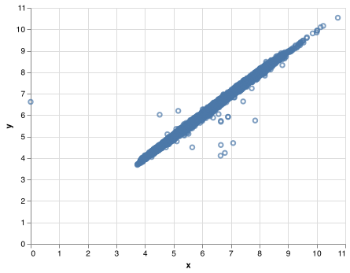

```

To plot `np.nan` as `0` then set `invalid = None`:

```{python}
chart = (alt.Chart(diamonds2).
    encode(
      x = 'x', 
      y = 'y').
      mark_circle(invalid = None)
    )

chart.save("screenshots/altair_diamonds2_zero.png")            
```

```{R, echo=FALSE, fig.align="left"}

knitr::include_graphics("screenshots/altair_diamonds2_zero.png")

```

Other times you want to understand what makes observations with missing values different to observations with recorded values. For example, in `flights`, missing values in the `dep_time` variable indicate that the flight was cancelled. So you might want to compare the scheduled departure times for cancelled and non-cancelled times. You can do this by making a new variable with `pd.isna()`.

```{python}
flights_url = "https://github.com/byuidatascience/data4python4ds/raw/master/data-raw/flights/flights.csv"

flights = pd.read_csv(flights_url)
flights['time_hour'] = pd.to_datetime(flights.time_hour, format = "%Y-%m-%d %H:%M:%S")

pdat = flights.assign(
  cancelled = lambda x: pd.isna(x.dep_time),
  sched_hour = lambda x: x.sched_dep_time // 100,
  sched_minute = lambda x: x.sched_dep_time % 100,
  sched_dep_time = lambda x: x.sched_hour + x.sched_minute / 60  
  )

chart = (alt.Chart(pdat).
      encode(
        x = alt.X('sched_dep_time', bin = alt.Bin(step = .25)), 
        y = 'count()',
        color = 'cancelled').
        mark_bar()
        )

chart.save("screenshots/altair_flights_scheduled.png")

```

```{R, echo=FALSE, fig.align="left"}

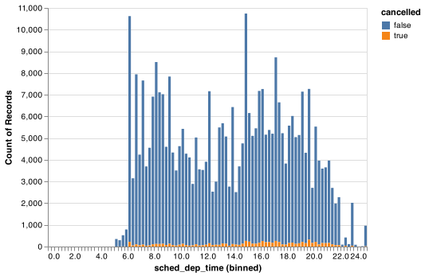

```
However this plot isn't great because there are many more non-cancelled flights than cancelled flights. In the next section we'll explore some techniques for improving this comparison.

### Exercises

1.  What does `invalid = None` do in Altair?

## Covariation

If variation describes the behavior _within_ a variable, covariation describes the behavior _between_ variables. **Covariation** is the tendency for the values of two or more variables to vary together in a related way. The best way to spot covariation is to visualise the relationship between two or more variables. How you do that should again depend on the type of variables involved.

### A categorical and continuous variable {#cat-cont}

It's common to want to explore the distribution of a continuous variable broken down by a categorical variable. The default appearance of `mark_bar()` is not that useful for that sort of comparison because the height is given by the count. That means if one of the groups is much smaller than the others, it's hard to see the differences in shape. For example, let's explore how the price of a diamond varies with its quality:

```{python}
chart = (alt.Chart(diamonds).
  encode(
     x= alt.X('price', bin = alt.Bin(step = 500)), 
     y = 'count()', 
     color = 'cut').
     mark_bar()
     )

chart.save("screenshots/altair_diamonds_price_cut.png")
```

```{R, echo=FALSE, fig.align="left"}

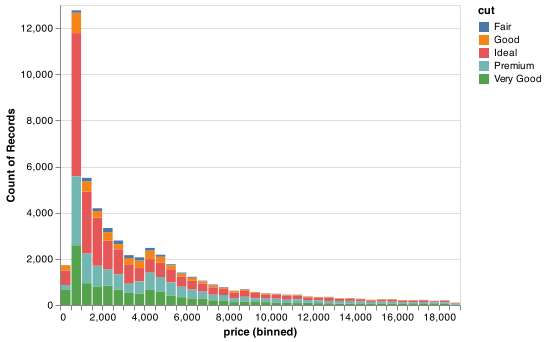

```

It's hard to see the difference in distribution because the overall counts differ so much:

```{python}
chart = (alt.Chart(diamonds).
    encode(
      x = alt.X('cut:O', scale=alt.Scale(domain=['Fair', 'Good', 'Very Good', 'Premium', 'Ideal'])), 
      y = 'count()').
      mark_bar().
      properties(width = 400))

chart.save("screenshots/altair_diamonds_price_cut_bar.png")
```

```{R, echo=FALSE, fig.align="left", fig.width = "50%", fig.width = 4}

knitr::include_graphics("screenshots/altair_diamonds_price_cut_bar.png")

```

To make the comparison easier we need to create a chart with __density__ displayed on the y-axis, which is the count standardised so that the area under each curve is one. To do this we must use `transform_density` which is one of many `transform_` functions in Altair. 

```{python}
chart = (alt.Chart(diamonds).
  transform_density(
    density = 'price', 
    bandwidth = 500,
    counts = True,
    steps = 500,
    as_ = ['price', 'density'],
    groupby = ['cut']).
  encode(
    x = 'price', 
    y = alt.Y('density:Q', stack = 'zero'),
    color = alt.Color('cut:O', 
          scale=alt.Scale(scheme='dark2', domain=['Fair', 'Good', 'Very Good', 'Premium', 'Ideal']), 
          )).
  mark_bar(opacity = .20)
)

chart.save("screenshots/altair_diamonds_price_density.png")
```

```{R, echo=FALSE, fig.align="left", fig.width = "50%", fig.width = 4}

knitr::include_graphics("screenshots/altair_diamonds_price_density.png")

```

There's something rather surprising about this plot - it appears that fair diamonds (the lowest quality) have the highest average price!  But maybe that's because frequency polygons are a little hard to interpret - there's a lot going on in this plot.

Another alternative to display the distribution of a continuous variable broken down by a categorical variable is the boxplot. A **boxplot** is a type of visual shorthand for a distribution of values that is popular among statisticians. Each boxplot consists of:

* A box that stretches from the 25th percentile of the distribution to the
  75th percentile, a distance known as the interquartile range (IQR). In the
  middle of the box is a line that displays the median, i.e. 50th percentile,
  of the distribution. These three lines give you a sense of the spread of the
  distribution and whether or not the distribution is symmetric about the
  median or skewed to one side.

* Visual points that display observations that fall more than 1.5 times the
  IQR from either edge of the box. These outlying points are unusual
  so are plotted individually.

* A line (or whisker) that extends from each end of the box and goes to the
  farthest non-outlier point in the distribution.

```{r, echo = FALSE, out.width = "100%"}
knitr::include_graphics("images/EDA-boxplot.png")
```

Let's take a look at the distribution of price by cut using `geom_boxplot()`:


```{python}
chart = (alt.Chart(diamonds).
    encode(
      x = 'cut', 
      y = 'price').
    mark_boxplot(size = 25).
    properties(width = 300)
)

chart.save("screenshots/altair_boxplot_2.png")

```

```{r, echo = FALSE, out.width = "50%"}
knitr::include_graphics("screenshots/altair_boxplot_2.png")
```


We see much less information about the distribution, but the boxplots are much more compact so we can more easily compare them (and fit more on one plot). It supports the counterintuitive finding that better quality diamonds are cheaper on average! In the exercises, you'll be challenged to figure out why.

`cut` is an ordered factor: fair is worse than good, which is worse than very good and so on. Many categorical variables don't have such an intrinsic order, so you might want to reorder them to make a more informative display. One way to do that is within the `alt.X() or alt.Y()` functions with the `sort` argument that accepts a string of the encoding channel used for the sort (e.g. `'x'` or `'y'`) with an optional minus prefix for descending order. Another options that will work with all Altair mark types is to use pandas to define the ordering of the categorical levels to use in `alt.Scale()` with the `domain` argument.

For example, take the `class` variable in the `mpg` dataset. You might be interested to know how highway mileage varies across classes:

```{python}
mpg = pd.read_csv("https://github.com/byuidatascience/data4python4ds/raw/master/data-raw/mpg/mpg.csv")

chart = (alt.Chart(mpg).
      encode(
        x = 'class', 
        y = 'hwy').
      mark_boxplot(size = 25).
      properties(width = 300)
)

chart.save("screenshots/altair_boxplot_3.png")

```

```{r, echo = FALSE, out.width = "50%"}
knitr::include_graphics("screenshots/altair_boxplot_3.png")
```

To make the trend easier to see, we can reorder `class` based on the median value of `hwy`:

```{python}
index = list(mpg.groupby('class').median().sort_values('hwy').index)

chart = (alt.Chart(mpg).
      encode(
        x = alt.X('class', scale = alt.Scale(domain = index)), 
        y = 'hwy').
      mark_boxplot(size = 25).
      properties(width = 300)
)

chart.save("screenshots/altair_boxplot_4.png")

```

```{r, echo = FALSE, out.width = "50%"}
knitr::include_graphics("screenshots/altair_boxplot_4.png")
```

If you have long variable names, `mark_boxplot()` will work better if you flip it 90°. You can do that with changing the `x` and `y` encodings.

```{python}
chart = (alt.Chart(mpg).
      encode(
        y = alt.Y('class', scale = alt.Scale(domain = index)), 
        x = 'hwy').
      mark_boxplot(size = 25).
      properties(height = 300)
)

chart.save("screenshots/altair_boxplot_5.png")

```

```{r, echo = FALSE, out.width = "50%"}
knitr::include_graphics("screenshots/altair_boxplot_5.png")
```

#### Exercises

1.  Use what you've learned to improve the visualisation of the departure times
    of cancelled vs. non-cancelled flights.

1.  What variable in the diamonds dataset is most important for predicting
    the price of a diamond? How is that variable correlated with cut?
    Why does the combination of those two relationships lead to lower quality
    diamonds being more expensive?

### Two categorical variables

To visualise the covariation between categorical variables, you'll need to count the number of observations for each combination. One way to do that is to compute the count with pandas:

```{python}
chart_dat = (diamonds.
    groupby(['color', 'cut']).
    size().
    reset_index(name = 'n')
    )
    
chart_dat.head()
```

Then visualise with `geom_tile()` and the fill aesthetic:

```{python}
chart = (alt.Chart(chart_dat).
  encode(
    x = 'color', 
    y = 'cut', 
    color = 'n',
    stroke = alt.value('grey')).
    mark_rect()
    )

chart.save("screenshots/altair_heatmap.png")

```

```{r, echo = FALSE}
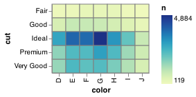
```

If the categorical variables are unordered, you might want to simultaneously reorder the rows and columns in order to more clearly reveal interesting patterns. 

#### Exercises

1.  How could you rescale the count dataset above to more clearly show
    the distribution of cut within colour, or colour within cut?

1.  Use `mark_rect()` together with pandas to explore how average flight
    delays vary by destination and month of year.  What makes the
    plot difficult to read? How could you improve it?

### Two continuous variables

You've already seen one great way to visualise the covariation between two continuous variables: draw a scatterplot with `mark_point()`. You can see covariation as a pattern in the points. For example, you can see an exponential relationship between the carat size and price of a diamond.

```{python}
chart = (alt.Chart(diamonds).
    encode(
      x = 'carat', 
      y = 'price').
    mark_circle()
    )

chart.save("screenshots/altair_diamonds_scatter_eda.png")

```

```{r, echo = FALSE}
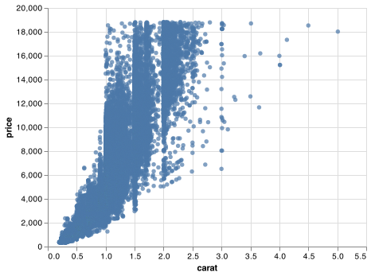
```

Scatterplots become less useful as the size of your dataset grows, because points begin to overplot, and pile up into areas of uniform black (as above).
You've already seen one way to fix the problem: using the `opacity` argument to add transparency.

```{python}
chart = (alt.Chart(diamonds).
    encode(
      x = 'carat', 
      y = 'price').
    mark_circle(opacity = 1/100)
    )

chart.save("screenshots/altair_diamonds_scatter_eda_2.png")

```

```{r, echo = FALSE}
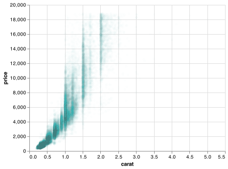
```

But using transparency can be challenging for very large datasets. Another solution is to use bins. Previously you used `mark_histogram()` to bin in one dimension. We will need to use pandas to bin in two directions. First create two new columns that bin `price` and `carat`.

```{python, cache=FALSE}
chart_dat = (smaller.
    assign(
      price_cut = lambda x: pd.cut(x.price, 
                        bins = np.arange(0, 20000, step = 1000), 
                        labels = np.arange(0, 19000, step = 1000)), 
      carat_cut = lambda x: pd.cut(x.carat, 
                        bins = np.arange(0, 5.4, step = .2), 
                        labels = np.arange(0, 5.2, step = .2))
      ))
      
chart_dat.head()      
```

Then create the binned counts and replace all zero counts with `np.nan`.

```{python, cache=FALSE}
chart_dat_binned = (chart_dat.
    groupby(['carat_cut', 'price_cut']).
    size().
    reset_index(name = 'n'))

chart_dat_binned['n'].replace(to_replace = 0, value = np.nan, inplace = True)

chart_dat_binned.head()    
```

`mark_rect` can then use the divided coordinate plane (2d bins) and then use a fill color to display how many points fall into each bin. Notice the use of `sort = 'y'' to reorient the y-axis.

```{python}
chart = (alt.Chart(chart_dat_binned).
    encode(
      x = 'carat_cut', 
      y = alt.Y('price_cut', sort = '-y'), 
      color = 'n:Q').
      mark_rect()
    )

chart.save("screenshots/altair_diamonds_scatter_binned.png")
```

```{r, echo = FALSE}
knitr::include_graphics("screenshots/altair_diamonds_scatter_binned.png")
```

Another option is to bin one continuous variable so it acts like a categorical variable. Then you can use one of the techniques for visualising the combination of a categorical and a continuous variable that you learned about. For example, you could bin `carat` and then for each group, display a boxplot:

```{python}
chart = (alt.Chart(chart_dat).
    encode(
      x = 'carat_cut:O', 
      y = 'price').
      mark_boxplot().
      properties(width = 300)
      )

chart.save("screenshots/altair_diamonds_scatter_binned_boxplot.png")
```

```{r, echo = FALSE, out.width = "50%"}
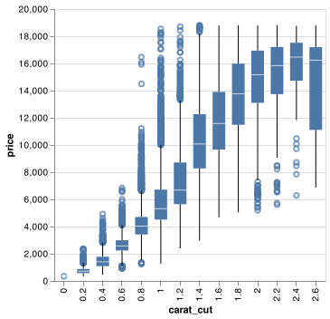
```

`pd.cut()`, as used above, divides `x` into bins of equal widths. By default, boxplots look roughly the same (apart from number of outliers) regardless of how many observations there are, so it's difficult to tell that each boxplot summarises a different number of points. One approach is to display approximately the same number of points in each bin. That's the job of `pd.qcut()`:

```{python}
chart_dat = smaller.assign(carat_cut = lambda x: pd.qcut(x.carat,10, labels = False))

chart = (alt.Chart(chart_dat).
  encode(
    x = 'carat_cut:O', 
    y = 'price').
    mark_boxplot().
    properties(width = 300)
    )


chart.save("screenshots/altair_diamonds_scatter_binned_boxplot_quantiles.png")
```

```{r, echo = FALSE, out.width = "50%"}
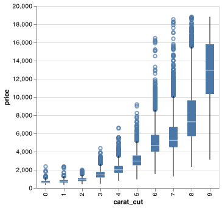
```

#### Exercises

1.  Visualise the distribution of carat, partitioned by price.

1.  How does the price distribution of very large diamonds compare to small
    diamonds? Is it as you expect, or does it surprise you?

1.  Combine two of the techniques you've learned to visualise the
    combined distribution of cut, carat, and price.

1. Two dimensional plots reveal outliers that are not visible in one
   dimensional plots. For example, some points in the plot below have an
   unusual combination of `x` and `y` values, which makes the points outliers
   even though their `x` and `y` values appear normal when examined separately.

    ```{python}
    chart = (alt.Chart(diamonds).
          encode(
            x = alt.X('x', scale = alt.Scale(domain = (4, 11))), 
            y = alt.Y('y', scale = alt.Scale(domain = (4, 11)))).
          mark_circle(clip = True))
    
    chart.save("screenshots/altair_diamonds_scatter_clip.png")
    ```
    
    ```{r, echo = FALSE}
    knitr::include_graphics("screenshots/altair_diamonds_scatter_clip.png")
    ```

    Why is a scatterplot a better display than a binned plot for this case? What
    does `clamp = True` in `alt.Scale()` do due your chart?

## Patterns and models

Patterns in your data provide clues about relationships. If a systematic relationship exists between two variables it will appear as a pattern in the data. If you spot a pattern, ask yourself:

+ Could this pattern be due to coincidence (i.e. random chance)?

+ How can you describe the relationship implied by the pattern?

+ How strong is the relationship implied by the pattern?

+ What other variables might affect the relationship?

+ Does the relationship change if you look at individual subgroups of the data?

A scatterplot of Old Faithful eruption lengths versus the wait time between eruptions shows a pattern: longer wait times are associated with longer eruptions. The scatterplot also displays the two clusters that we noticed above.

```{python}
chart = (alt.Chart(faithful).
  encode(
    x = alt.X('eruptions', scale=alt.Scale(zero=False)), 
    y = alt.Y('waiting', scale=alt.Scale(zero=False))).
    mark_circle()
)

chart.save("screenshots/altair_faithful_scatter_clip.png")
```

```{r fig.height = 2, echo=FALSE}
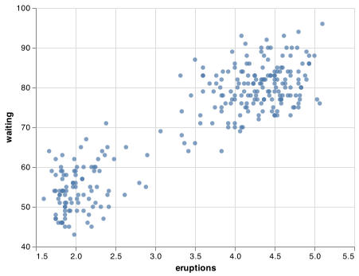
```

Patterns provide one of the most useful tools for data scientists because they reveal covariation. If you think of variation as a phenomenon that creates uncertainty, covariation is a phenomenon that reduces it. If two variables covary, you can use the values of one variable to make better predictions about the values of the second. If the covariation is due to a causal relationship (a special case), then you can use the value of one variable to control the value of the second.

Models are a tool for extracting patterns out of data. For example, consider the diamonds data. It's hard to understand the relationship between cut and price, because cut and carat, and carat and price are tightly related. It's possible to use a model to remove the very strong relationship between price and carat so we can explore the subtleties that remain. The following code fits a model that predicts `price` from `carat` and then computes the residuals (the difference between the predicted value and the actual value). The residuals give us a view of the price of the diamond, once the effect of carat has been removed.

```{python, cache = FALSE}
import statsmodels.formula.api as smf

mod = smf.ols('np.log(price) ~ np.log(carat)', data = diamonds).fit()

diamonds2 = diamonds.assign(resid = np.exp(mod.resid))

chart = (alt.Chart(diamonds2).
            encode(
              x = 'carat', 
              y = 'resid').
              mark_circle()
          )

chart.save("screenshots/altair_diamonds_model_scatter.png")

```

```{r fig.height = 2, echo=FALSE}
knitr::include_graphics("screenshots/altair_diamonds_model_scatter.png")
```

Once you've removed the strong relationship between carat and price, you can see what you expect in the relationship between cut and price: relative to their size, better quality diamonds are more expensive.

```{python}
chart = (alt.Chart(diamonds2).
          encode(
            x = 'cut', 
            y = 'resid').
          mark_boxplot(size = 25).
          properties(width = 300)
        )

chart.save("screenshots/altair_diamonds_model_boxplot.png")
```

```{r out.width = "50%", echo=FALSE}
knitr::include_graphics("screenshots/altair_diamonds_model_boxplot.png")
```

You'll learn how models, and the modelr package, work in the final part of the book, [model](#model-intro). We're saving modelling for later because understanding what models are and how they work is easiest once you have tools of data wrangling and programming in hand.

## Altair calls

As we move on from these introductory chapters, we'll transition to a more concise expression of Altair code. So far we've been very explicit, which is helpful when you are learning:

```{python, eval = FALSE}
(alt.Chart(faithful).
  encode(
      x = alt.X('eruptions'), 
      y = alt.Y('waiting')).
      mark_circle()
  )
```

In the remainder of the book, we won't supply the `x` and `y` names if we are using `alt.X()` and `alt.Y()`. That saves typing, and, by reducing the amount of boilerplate, makes it easier to see what's different between plots. That's a really important programming concern that we'll come back in [functions]. In addition, for less complicated charts, we will not use `()` with each element on it's own line. Altair guidance also often places the `mark_` before the `encode()`.

Rewriting the previous plot more concisely yields:

```{python, eval = FALSE}
alt.Chart(faithful).encode(
  alt.X('eruptions'), 
  alt.Y('waiting')).mark_circle()
  
```

Altair guidance also often places the `mark_` before the `encode()` to allow the final element to be the encoding which can easily be placed on multiple lines without the need of `()` around the entire command.

```{python, eval = FALSE}
alt.Chart(faithful).mark_circle().encode(
  alt.X('eruptions'), 
  alt.Y('waiting'))
  
```

## Learning more

If you want to learn more about the mechanics of Altair, I'd highly recommend reveiwing the Altair website: <https://altair-viz.github.io/getting_started/overview.html>. 

Another useful resource is the [_Vega-Lite website_](https://vega.github.io/vega-lite/). 

