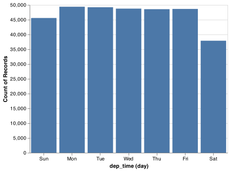
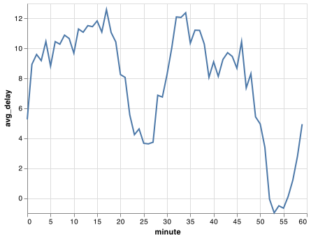
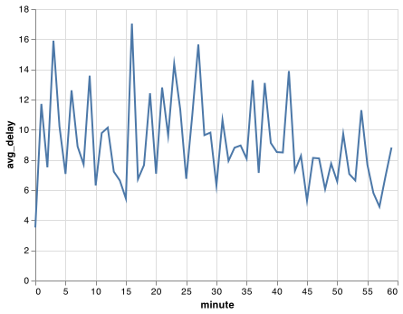
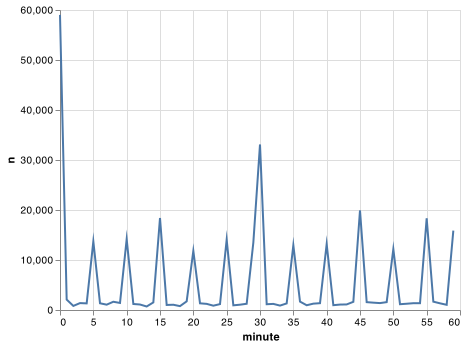
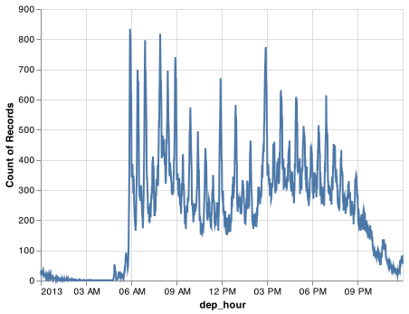

# Dates and times

<!-- https://creativecommons.org/2020/04/21/academic-publications-under-no-derivatives-licenses-is-misguided/ -->

```{r, echo=FALSE}
knitr::opts_chunk$set(python.reticulate = TRUE)
library(reticulate)
library(ggplot2)
library(vegawidget)
use_python("usr/local/bin/python3")
```

## Introduction

This chapter will show you how to work with dates and times in pandas. At first glance, dates and times seem simple. You use them all the time in your regular life, and they don't seem to cause much confusion. However, the more you learn about dates and times, the more complicated they seem to get. To warm up, try these three seemingly simple questions:

* Does every year have 365 days?
* Does every day have 24 hours?
* Does every minute have 60 seconds?

I'm sure you know that not every year has 365 days, but do you know the full rule for determining if a year is a leap year? (It has three parts.) You might have remembered that many parts of the world use daylight savings time (DST), so that some days have 23 hours, and others have 25. You might not have known that some minutes have 61 seconds because every now and then leap seconds are added because the Earth's rotation is gradually slowing down.

Dates and times are hard because they have to reconcile two physical phenomena (the rotation of the Earth and its orbit around the sun) with a whole raft of geopolitical phenomena including months, time zones, and DST. This chapter won't teach you every last detail about dates and times, but it will give you a solid grounding of practical skills that will help you with common data analysis challenges.

### Prerequisites

This chapter will focus on the [pandas time series functionality](https://pandas.pydata.org/pandas-docs/stable/user_guide/timeseries.html) and the [Timestamp](https://pandas.pydata.org/pandas-docs/stable/reference/api/pandas.Timestamp.html) methods in pandas, which makes it easier to work with dates and times in Python. We will also need nycflights13 for practice data.

```{python setup, message = FALSE, cache = FALSE}
import pandas as pd
import altair as alt
import numpy as np
import datetime

alt.data_transformers.enable('json')
flights = pd.read_csv("https://github.com/byuidatascience/data4python4ds/raw/master/data-raw/flights/flights.csv")

```

## Creating date/times

pandas has two primary types of date/time data that refers to an instant in time:

* A __datetime__ is a date plus a time: it uniquely identifies an
  instant in time (typically to the nearest second). pandas reports these types
  as `datetime64`. The NumPy team established this native time series data type. 
  Being encoded as 64-bit integers allows arrays of dates to be represented very 
  compactly [ref](https://jakevdp.github.io/PythonDataScienceHandbook/03.11-working-with-time-series.html).
* A __Timestamp__ is a subclass of a datetime.datetime object. This pandas class 
  provides the speed and ease of use in handling complex time handling.

In this chapter we are only going to focus on dates and date-times. We will focus on the pandas tools for dates and times and use the `datetime` python module for some elements of handling time in Python.

To get the current date or date-time you can use `date.today()` or `datetime.now()`:

```{python}
# using datetime
datetime.datetime.today()
datetime.datetime.now()
datetime.datetime.utcnow()
# using pandas
pd.to_datetime('today')
pd.to_datetime('now')
```

Otherwise, there are three ways you're likely to create a date/time:

* From a string.
* From individual date-time components.
* From an existing date/time object.

They work as follows.

### From strings

Date/time data often comes as strings. You've seen one approach to parsing strings into date-times in [date-times](#readr-datetimes). Another approach is to use the helpers provided by pandas. They can work out the format of unambiguous dates. For example:

```{python}
pd.to_datetime("2017-01-31")
pd.to_datetime("January 31st, 2017")
pd.to_datetime("31-Jan-2017")

# using timestamp
pd.Timestamp("2017-01-31")
pd.Timestamp("January 31st, 2017")
pd.Timestamp("31-Jan-2017")
```

You can specify component order for ambiguous dates with `pd.to_datetime()`. For example:

```{python}
pd.to_datetime('10-11-09')
pd.to_datetime('10-11-09', yearfirst=True)
pd.to_datetime('10-11-09', dayfirst=True)
pd.to_datetime('10-11-09', format = '%d-%y-%m')
```


If you use numbers in `pd.to_datetime()` it is interpreted as the number of nanoseconds from 1970-01-01. However, the unit can be changed.

```{python}
pd.to_datetime(100000000)
pd.to_datetime(100000000, unit = 'ns')
pd.to_datetime(1, unit = 's')
```

To input time into a datetime add the `hh:mm:ss` format into the string of the parsing function:

```{python}
pd.to_datetime("2017-01-31 20:11:59")
pd.to_datetime("01/31/2017 08:01")

pd.Timestamp("2017-01-31 20:11:59")
pd.Timestamp("01/31/2017 08:01")
```

### From individual components

Instead of a single string, sometimes you'll have the individual components of the date-time spread across multiple columns. This is what we have in the flights data:

```{python}
flights.filter(['year', 'month', 'day', 'hour', 'minute']).head()
```

To create a date/time from this sort of input, use `Timestamp()`:

```{python}
(flights.
    filter(['year', 'month', 'day', 'hour', 'minute']).
    assign(departure = pd.to_datetime(flights[['year', 'month', 'day', 'hour', 'minute']]))
    )
```

Let's do the same thing for each of the four time columns in `flights`. The times are represented in a slightly odd format, so we use modulus arithmetic to pull out the hour and minute components. Once I've created the date-time variables, I focus in on the variables we'll explore in the rest of the chapter.


```{python, cache = FALSE}
# parsing function
def make_datetime_100(data, time):
    date_data = (data[['year', 'month', 'day', time]].
        assign(
            hour = lambda x: x[time] // 100,
            minute = lambda x: x[time] % 100).
        filter(['year', 'month', 'day', 'hour', 'minute'])
    )
    
    out = pd.to_datetime(date_data)

    return out
# data table
flights_dt = (flights.
    query('(dep_time.notna()) & (arr_time.notna())').
    assign(
        dep_time = lambda x: make_datetime_100(x, 'dep_time'),
        arr_time = lambda x: make_datetime_100(x, 'arr_time'),
        sched_dep_time = lambda x: make_datetime_100(x, 'sched_dep_time'),
        sched_arr_time = lambda x: make_datetime_100(x, 'sched_arr_time')
    ).
    filter( regex = 'origin|dest|delay$|time$')
)

flights_dt
```

With this data, I can visualise the distribution of departure times across the year:

```{python}
dat_plot = (flights_dt.
    filter(['dep_time']).
    assign(dpd = flights_dt.dep_time.dt.floor("D")).
    groupby(['dpd'], as_index = False).
    count())

chart = (alt.Chart(dat_plot).
          encode(x = 'dpd', y = 'dep_time').
          mark_line()) 
          
chart.save("screenshots/altair_datetimes_1.png")

```

```{R, echo=FALSE, fig.align="left"}
knitr::include_graphics("screenshots/altair_datetimes_1.png")
```


Or within a single day:

```{python}
dat_plot = (flights_dt.filter(['dep_time']).query("dep_time < 20130102").
    assign(dpd = flights_dt.dep_time.dt.floor("10min")).
    groupby(['dpd'], as_index = False).
    count())

chart = (alt.Chart(dat_plot).
    encode(x = 'dpd', y = 'dep_time').
    mark_line())

chart.save("screenshots/altair_datetimes_2.png")

```

```{R, echo=FALSE, fig.align="left"}
knitr::include_graphics("screenshots/altair_datetimes_2.png")
```

### From other types

Sometimes you'll get date/times as numeric offsets from the "Unix Epoch", 1970-01-01. If the offset is in seconds, use `as_datetime()`; if it's in days, use `as_date()`.

```{python}
pd.to_datetime(60 * 60 * 10, unit = 's')
pd.to_datetime(365 * 10 + 2, unit = 'd')
```

### Exercises

1.  What happens if you parse a string that contains invalid dates?

    ```{python, eval = FALSE}
    pd.to_datetime(['2010-10-10', 'bananas'])
    pd.to_datetime(['2010-10-10', 'bananas'], errors = 'coerce')
    ```

## Date-time components

Now that you know how to get date-time data into Python's datetime data structures, let's explore what you can do with them. This section will focus on the [Timestamp properites](https://pandas.pydata.org/pandas-docs/stable/user_guide/timeseries.html#time-date-components) that let you get and set individual components. The next section will look at how arithmetic works with datetimes.

### Getting components

You can pull out individual parts of the date with the accessor properties `.year`, `.month`, `.day()` (day of the month), `.dayofyear` (day of the year), `.dayofweek` (day of the week), `.hour`, `.minute`, and `.second`. When using these properties on a pandas series you must include `.dt.` as in `<PANDAS SERIES>.dt.month`. 

```{python}
datetime = pd.to_datetime("2016-07-08 12:34:56")

datetime.year
datetime.month
datetime.day
datetime.dayofyear
datetime.dayofweek
```

To return the name of the month or day of the week use the two name methods `.day_name()` and `month_name()`.

```{pandas}
datetime.month_name()
datetime.day_name()
```

We can use `.day_name()` in pandas to create a new variable for your chart or use `day()` in Altair to build the date variable only for the chart using the [TimeUnit transforms](https://altair-viz.github.io/user_guide/transform/timeunit.html)  to see that more flights depart during the week than on the weekend:

```{python}
flights_dt.dep_time.dt.day_name()

chart = (alt.Chart(flights_dt).
  encode(alt.X('day(dep_time):O'), alt.Y('count()')).
  mark_bar().
  properties(width = 400))
  
chart.save("screenshots/altair_datetimes_3.png")

```

```{R, echo=FALSE, fig.align="left"}

```


There's an interesting pattern if we look at the average departure delay by minute within the hour. It looks like flights leaving in minutes 20-30 and 50-60 have much lower delays than the rest of the hour!

```{python}
plot_dat = (flights_dt.assign(
    minute = lambda x: x.dep_time.dt.minute).
    groupby('minute').
    agg(
        avg_delay = ('arr_delay', np.mean),
        n = ('arr_delay', 'size')
    ).reset_index()
)

chart = (alt.Chart(plot_dat).
  encode(alt.X('minute'), alt.Y('avg_delay')).
  mark_line())
  
chart.save("screenshots/altair_datetimes_4.png")

```

```{R, echo=FALSE, fig.align="left"}

```


Interestingly, if we look at the _scheduled_ departure time we don't see such a strong pattern:

```{python}
sched_dep = (flights_dt.assign(
    minute = lambda x: x.sched_dep_time.dt.minute).
    groupby('minute').
    agg(
        avg_delay = ('arr_delay', np.mean),
        n = ('arr_delay', 'size')
    ).reset_index()
)

chart = (alt.Chart(sched_dep).
  encode(alt.X('minute'), alt.Y('avg_delay')).
  mark_line())
  
chart.save("screenshots/altair_datetimes_5.png")

```

```{R, echo=FALSE, fig.align="left"}

```


So why do we see that pattern with the actual departure times? Well, like much data collected by humans, there's a strong bias towards flights leaving at "nice" departure times. Always be alert for this sort of pattern whenever you work with data that involves human judgement!

```{python}
chart = (alt.Chart(sched_dep).
  encode(alt.X('minute'), alt.Y('n')).
  mark_line())
  
chart.save("screenshots/altair_datetimes_6.png")

```

```{R, echo=FALSE, fig.align="left"}

```

### Rounding

An alternative approach to plotting individual components is to round the date to a nearby unit of time, with `.dt.floor()`, `.dt.round()`, and `.dt.ceiling()`. However, these methods don't work well for coarser roundings. For example, finding the floor of week does not work using `dt.floor()` and the recommended approach is to use `.dt.to_period()` in tandem with `.dt.to_timestep()` as we do in the following example. Each method takes a Series of datetimes to adjust and then the name of the unit round down (floor), round up (ceiling), or round to. This, for example, allows us to plot the number of flights per week:

https://pandas.pydata.org/pandas-docs/stable/user_guide/timeseries.html#timeseries-offset-aliases

```{python}
plot_dat = flights_dt.assign(
    week = lambda x: x.dep_time.dt.to_period("W").dt.to_timestamp()
    ).groupby('week').agg(
        n = ('dep_time', 'size')
    ).reset_index()

chart = (alt.Chart(plot_dat).
  encode(alt.X('week'), alt.Y('n')).
  mark_line())

chart.save("screenshots/altair_datetimes_7.png")

```

```{R, echo=FALSE, fig.align="left"}
knitr::include_graphics("screenshots/altair_datetimes_7.png")
```

Computing the difference between a rounded and unrounded date can be particularly useful.

### Setting components

You can also use each accessor function to set the components of a date/time:

```{python}
datetime = pd.Timestamp("2016-07-08 12:34:56")
datetime.replace(year = 2020)
datetime.replace(month = 1)
datetime.replace(hour = datetime.hour + 1)
```

Alternatively, Rather than modifying each separately, you can create a new date-time with `replace()` using all of the arguments. This allows you to set multiple values at once.

```{python}
datetime.replace(year = 2020, month = 2, day = 2, hour = 2)
```

If values are too big, you will see an error:

```{python, error=TRUE}
pd.Timestamp("2015-02-01").replace(day = 30)

```

You can use `replace()` to show the distribution of flights across the course of the day for every day of the year:

__Note:__ The `Timestamp.replace()` method does not have an equivalent method that can be used on pandas Series so you will need to use an `apply()` method on the datetime series. We have avoided the use of `apply()` in this book up to this point.  `apply()` is a powerful technique within pandas that is worth your time to master. You can read [the pandas documentation](https://pandas.pydata.org/pandas-docs/stable/reference/api/pandas.DataFrame.apply.html) to find additional help.

```{python}
plot_dat = flights_dt.assign(
    dep_hour = lambda x: x.dep_time.apply(lambda y: y.replace(month = 1, day = 1))
    )

chart = (alt.Chart(plot_dat).
  encode(alt.X('dep_hour'), alt.Y('count()')).
  mark_line())

chart.save("screenshots/altair_datetimes_8.png")

```

```{R, echo=FALSE, fig.align="left"}

```

Setting larger components of a date to a constant is a powerful technique that allows you to explore patterns in the smaller components.

### Exercises

1.  How does the distribution of flight times within a day change over the
    course of the year?

1.  Compare `dep_time`, `sched_dep_time` and `dep_delay`. Are they consistent?
    Explain your findings.

1.  Compare `air_time` with the duration between the departure and arrival.
    Explain your findings. (Hint: consider the location of the airport.)

1.  How does the average delay time change over the course of a day?
    Should you use `dep_time` or `sched_dep_time`? Why?

1.  On what day of the week should you leave if you want to minimise the
    chance of a delay?

1.  What makes the distribution of `diamonds.carat` and
    `flights.sched_dep_time` similar?

1.  Confirm my hypothesis that the early departures of flights in minutes
    20-30 and 50-60 are caused by scheduled flights that leave early.
    Hint: create a binary variable that tells you whether or not a flight
    was delayed.

## Time spans (Deltas)

Next you'll learn about how arithmetic with dates work, including subtraction, addition, and division. Along the way, you'll learn about pandas tools for representing time spans. In Python, when you subtract two dates, you get a Timedelta object:

```{python}
# How old is Hathaway?
h_age = pd.Timestamp.now() - pd.Timestamp("19770907")
h_age
```

A Timedelta object records a time span in nanoseconds using 64 bit integers which can make Timedeltas a little painful to work with, so Timedelta provides access to the number of days with `.days` and the number of seconds with `.total_seconds()`.

```{Python}
h_age.days
h_age.days // 365 # to get years
h_age.total_seconds()
```

Timedeltas come with a bunch of convenient constructors:

```{python}
pd.Timedelta(seconds = 15)
pd.Timedelta(minutes = 10)
pd.Timedelta(hours = 12)
pd.Timedelta(hours = 24)
pd.Timedelta(days = 5)
pd.Timedelta(weeks = 3)
# to create a series of Timedeltas you can use a for loop.
pd.Series([pd.Timedelta(days=i) for i in range(5)])
```

```{python}
2*pd.Timedelta(days = 365)
pd.Timedelta(days = 365) + pd.Timedelta(weeks = 12) + pd.Timedelta(hours = 15)
```

You can add and subtract Timedeltas to and from days:

```{python}
tomorrow = pd.Timestamp.today() + pd.Timedelta(days = 1)
last_year = pd.Timestamp.today() - pd.Timedelta(days = 365)
```

And of course, add them to dates. Timedeltas are strict durations based on the arguments.  Those durations do work across the various novelties of daylight savings time and leaps in the calendar like February 29th.

```{python}
# A leap year
pd.Timestamp("2020-02-01") + pd.Timedelta(days = 30)
# Not a leap year
pd.Timestamp("2019-02-01") + pd.Timedelta(days = 30)
# Daylight Savings Time
one_pm = pd.Timestamp('2016-03-12 13:00:00', tz = 'America/New_York')
# Day two 1pm 
one_pm_d2 = pd.Timestamp('2016-03-13 13:00:00', tz = 'America/New_York')


one_pm + pd.Timedelta(days = 1)
one_pm + pd.Timedelta(hours = 24)

# Notice that it correctly represents that only 23 hours had passed. 
one_pm_d2 - one_pm

```

Let's use Timedeltas to fix an oddity related to our flight dates. Some planes appear to have arrived at their destination _before_ they departed from New York City.

```{python}
flights_dt.query('arr_time < dep_time')
```

These are overnight flights. We used the same date information for both the departure and the arrival times, but these flights arrived on the following day. We can fix this by adding `days(1)` to the arrival time of each overnight flight.

```{python, cache = FALSE}
flights_dt = flights_dt.assign(
    overnight_TF = lambda x: x.arr_time < x.dep_time,
    overnight = lambda x: x.overnight_TF.astype('int').apply(lambda y: pd.Timedelta(days = y)),
    arr_time = lambda x: x.arr_time + x.overnight,
    sched_arr_time = lambda x: x.sched_arr_time + x.overnight
)
```

Now all of our flights obey the laws of physics.

```{python}
flights_dt.query('arr_time < dep_time')
```

## Time zones

Time zones are an enormously complicated topic because of their interaction with geopolitical entities. Fortunately we don't need to dig into all the details as they're not all important for data analysis, but there are a few challenges we'll need to tackle head on.

The first challenge is that everyday names of time zones tend to be ambiguous. For example, if you're American you're probably familiar with EST, or Eastern Standard Time. However, both Australia and Canada also have EST! To avoid confusion, The Python package [pytz](https://pypi.org/project/pytz/) uses the international standard IANA time zones. These use a consistent naming scheme "<area>/<location>", typically in the form "\<continent\>/\<city\>" (there are a few exceptions because not every country lies on a continent). Examples include "America/New_York", "Europe/Paris", and "Pacific/Auckland".  Pandas leverages the pytz package to handle time zones.

You might wonder why the time zone uses a city, when typically you think of time zones as associated with a country or region within a country. This is because the IANA database has to record decades worth of time zone rules. In the course of decades, countries change names (or break apart) fairly frequently, but city names tend to stay the same. Another problem is that name needs to reflect not only to the current behaviour, but also the complete history. For example, there are time zones for both "America/New_York" and "America/Detroit". These cities both currently use Eastern Standard Time but in 1969-1972 Michigan (the state in which Detroit is located), did not follow DST, so it needs a different name. It's worth reading the raw time zone database (available at <http://www.iana.org/time-zones>) just to read some of these stories!

You can find out what Python thinks your current time zone is with `Sys.timezone()`:

```{python}
import time
time.tzname

```

To see the complete list of all time zone Olson names for a country use `pytz.country_timezones()`:

```{python}
import pytz
pytz.country_timezones('US')
# pytz.all_timezones()
```

In Python, the time zone is an attribute of the date-time that only controls printing. For example, these three objects represent the same instant in time:

```{python}
x1 = pd.Timestamp("2015-06-01 12:00:00", tz = 'America/New_York')
x2 = pd.Timestamp("2015-06-01 18:00:00", tz = 'Europe/Copenhagen')
x3 = pd.Timestamp("2015-06-01 04:00:00", tz = 'Pacific/Auckland')
```

You can verify that they're the same time by converting to UTC and comparing the offsets

```{python}
x1.tz_convert('utc')
x2.tz_convert('utc')
x3.tz_convert('utc')
```

You can't do subtraction with Timestamps of different time zones:

```{python, error=TRUE}
x1 - x2
x1 - x3
```

But Timedeltas can be calculated after using `.tz_convert()`:

```{python}
x1.tz_convert('utc') - x2.tz_convert('utc')

```


Unless otherwise specified, `pd.Timestampe()` is not timezone aware.  UTC (Coordinated Universal Time) is the standard time zone used by the scientific community and roughly equivalent to its predecessor GMT (Greenwich Mean Time). It does not have DST, which makes a convenient representation for computation. Operations that combine date-times into a Series will often convert the time zone to UTC and then return the Series as an object or character string.

```{python}
x4 = pd.Series([x1, x2, x3])
x4
```

Combining elements that all have the same time zone will return a datetime object with that specified time zone:

```{python}
x5 = pd.Series([x1.tz_convert('utc'), x2.tz_convert('utc'), x3.tz_convert('utc')])
x5
```

Finally, Timestamp objects that don't have a specified time zone will state ase datetime objects:

```{python}
pd.Series([pd.Timestamp("2015-06-01 04:00:00"), pd.Timestamp("2015-06-01 04:00:00")])
```


You can change the time zone in two ways:

*   Keep the instant in time the same, and change how it's displayed.
    Use this when the instant is correct, but you want a more natural
    display.

    ```{python}
    x5a = x5.dt.tz_convert('Australia/Lord_Howe')
    x5a
    ```

    (This also illustrates another challenge of times zones: they're not
    all integer hour offsets!)

*   Change the underlying instant in time. Use `None` to strip the time zone
    when you have an instant that has been labelled with the incorrect time 
    zone, and you need to fix it.

    ```{python}
    x5b = x5.dt.tz_localize(None).dt.tz_localize('Australia/Lord_Howe')
    x5b
    ```
