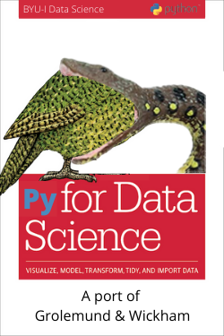

---
knit: "bookdown::render_book"
title: "Python for Data Science"
author: ["J. Hathaway"]
description: "This book will teach you how to do data science with ~~R~~ Python: You'll learn how to get your data into Python, get it into the most useful structure, transform it, visualise it and model it. In this book, you will find a practicum of skills for data science. Just as a chemist learns how to clean test tubes and stock a lab, you'll learn how to clean data and draw plots---and many other things besides. These are the skills that allow data science to happen, and here you will find the best practices for doing each of these things with Python. You'll learn how to use the grammar of graphics, literate programming, and reproducible research to save time. You'll also learn how to manage cognitive resources to facilitate discoveries when wrangling, visualising, and exploring data."
url: 'https://byuidatascience.github.io/python4ds/'
github-repo: byuidatascience/python4ds
twitter-handle: byuidss
cover-image: cover.png
site: bookdown::bookdown_site
documentclass: book
---

# Welcome {-} 

 This is the port of the website for __"[R for Data Science](https://r4ds.had.co.nz/index.html)"__ into Python. I am keeping Garrett Grolemund and Hadley Wickham's writing and examples as much as possible while demonstrating Python instead of R.

This book will teach you how to do data science with Python: You'll learn how to get your data into Python, get it into the most useful structure, transform it, visualise it and model it. In this book, you will find a practicum of skills for data science. Just as a chemist learns how to clean test tubes and stock a lab, you'll learn how to clean data and draw plots---and many other things besides. These are the skills that allow data science to happen, and here you will find the best practices for doing each of these things with R. You'll learn how to use the grammar of graphics, literate programming, and reproducible research to save time. You'll also learn how to manage cognitive resources to facilitate discoveries when wrangling, visualising, and exploring data. 

This website is (and will always be) __free to use__, and is licensed under the [Creative Commons Attribution-NonCommercial-NoDerivs 3.0](http://creativecommons.org/licenses/by-nc-nd/3.0/us/) License.  

The book is written in [RMarkdown](https://rmarkdown.rstudio.com) with [bookdown](https://bookdown.org). The orignial authors and contributors can be found [here](https://r4ds.had.co.nz/index.html)

