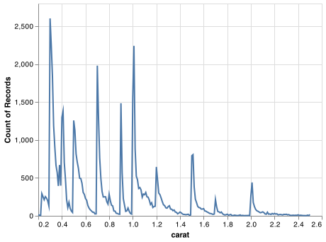

# Diamond Sizes

```python
# setup
import altair as alt
import pandas as pd
import numpy as np
alt.data_transformers.enable('json')
```

```python
# load and format data
diamonds = pd.read_csv("https://github.com/byuidatascience/data4python4ds/raw/master/data-raw/diamonds/diamonds.csv")
smaller = diamonds.query('carat <= 2.5')
```

We have data about diamonds. Only those larger than 2.5 carats. The distribution of the remainder is shown below:

```python
# plot data
chart = (alt.Chart(smaller).
    encode(alt.X('carat'), alt.Y('count()')).
    mark_line())

chart.save('markdown/diamonds_25.png')
```


