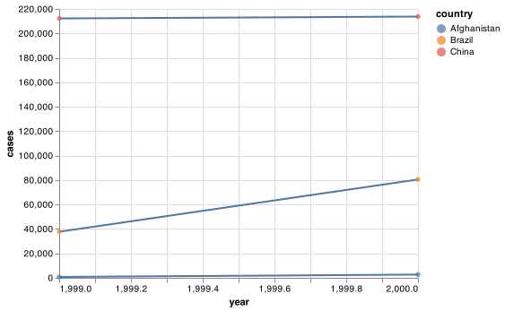

# Tidy data

```{r, echo=FALSE}
knitr::opts_chunk$set(python.reticulate = TRUE)
library(reticulate)
library(ggplot2)
library(vegawidget)
use_python("usr/local/bin/python3")
```


## Introduction

> "Happy families are all alike; every unhappy family is unhappy in its
> own way." --– Leo Tolstoy

> "Tidy datasets are all alike, but every messy dataset is messy in its
> own way." --– Hadley Wickham

In this chapter, you will learn a consistent way to organise your data in Python, an organisation called __tidy data__. Getting your data into this format requires some upfront work, but that work pays off in the long term. Once you have tidy data and pandas data frames, you will spend much less time munging data from one representation to another, allowing you to spend more time on the analytic questions at hand.

This chapter will give you a practical introduction to tidy data and the accompanying tools in the __pandas__ package. If you'd like to learn more about the underlying theory, you might enjoy the *Tidy Data* paper published in the Journal of Statistical Software, <http://www.jstatsoft.org/v59/i10/paper>.

### Prerequisites

In this chapter we'll focus on pandas, a package that provides a bunch of tools to help tidy up your messy datasets. 

<!-- http://shzhangji.com/blog/2017/09/30/pandas-and-tidy-data/ -->

```{python setup, message = FALSE, cache = FALSE}
import pandas as pd
import altair as alt
import numpy as np
```

## Tidy data

You can represent the same underlying data in multiple ways. The example below shows the same data organised in four different ways. Each dataset shows the same values of four variables *country*, *year*, *population*, and *cases*, but each dataset organises the values in a different way.

```{python, cache=FALSE}
base_url = "https://github.com/byuidatascience/data4python4ds/raw/master/data-raw/"
table1 = pd.read_csv("{}table1/table1.csv".format(base_url))
table2 = pd.read_csv("{}table2/table2.csv".format(base_url))
table3 = pd.read_csv("{}table3/table3.csv".format(base_url))
table4a = pd.read_csv("{}table4a/table4a.csv".format(base_url))
table4b = pd.read_csv("{}table4b/table4b.csv".format(base_url))
table5 = pd.read_csv("{}table5/table5.csv".format(base_url), dtype = 'object')

```


```{python}
table1
table2
table3

# Spread across two tibbles
table4a  # cases
table4b  # population
```

These are all representations of the same underlying data, but they are not equally easy to use. One dataset, the tidy dataset, will be much easier to work with inside the tidyverse.

There are three interrelated rules which make a dataset tidy:

1.  Each variable must have its own column.
1.  Each observation must have its own row.
1.  Each value must have its own cell.

Figure \@ref(fig:tidy-structure) shows the rules visually.

```{r tidy-structure, echo = FALSE, out.width = "100%", fig.cap = "Following three rules makes a dataset tidy: variables are in columns, observations are in rows, and values are in cells."}
knitr::include_graphics("images/tidy-1.png")
```

These three rules are interrelated because it's impossible to only satisfy two of the three. That interrelationship leads to an even simpler set of practical instructions:

1.  Put each dataset in a tibble.
1.  Put each variable in a column.

In this example, only `table1` is tidy. It's the only representation where each column is a variable.

Why ensure that your data is tidy? There are two main advantages:

1.  There's a general advantage to picking one consistent way of storing
    data. If you have a consistent data structure, it's easier to learn the
    tools that work with it because they have an underlying uniformity.

1.  There's a specific advantage to placing variables in columns because
    it allows pandas' and NumPy's vectorised nature to shine. As you learned in
    [assign](#mutate-funs) and [aggregate functions](#summary-funs), most
    built-in R functions work with vectors of values. That makes transforming
    tidy data feel particularly natural.

Altair and pandas work well with tidy data. Here are a couple of small examples showing how you might work with `table1`.

```{python}
# Compute rate per 10,000
table1.assign(
    rate = lambda x: x.cases / x.population * 1000
)
# Compute cases per year
(table1.
  groupby('year').
  agg(n = ('cases', 'sum')).
  reset_index())

# Visualise changes over time
# import altair as alt
base_chart = (alt.Chart(table1).
  encode(alt.X('year'), alt.Y('cases'), detail = 'country'))

chart = base_chart.mark_line() + base_chart.encode(color = 'country').mark_circle()

chart.save("screenshots/altair_table1.png")

```

```{R, echo=FALSE, out.width = "50%"}



```


### Exercises

1.  Using prose, describe how the variables and observations are organised in
    each of the sample tables.

1.  Compute the `rate` for `table2`, and `table4a` + `table4b`.
    You will need to perform four operations:

    1.  Extract the number of TB cases per country per year.
    1.  Extract the matching population per country per year.
    1.  Divide cases by population, and multiply by 10000.
    1.  Store back in the appropriate place.

    Which representation is easiest to work with? Which is hardest? Why?

1.  Recreate the plot showing change in cases over time using `table2`
    instead of `table1`. What do you need to do first?

## Pivoting

The principles of tidy data seem so obvious that you might wonder if you'll ever encounter a dataset that isn't tidy. Unfortunately, however, most data that you will encounter will be untidy. There are two main reasons:

1.  Most people aren't familiar with the principles of tidy data, and it's hard
    to derive them yourself unless you spend a _lot_ of time working with data.

1.  Data is often organised to facilitate some use other than analysis. For
    example, data is often organised to make entry as easy as possible.

This means for most real analyses, you'll need to do some tidying. The first step is always to figure out what the variables and observations are. Sometimes this is easy; other times you'll need to consult with the people who originally generated the data.

The second step is to resolve one of two common problems:

1. One variable might be spread across multiple columns.

1. One observation might be scattered across multiple rows.

Typically a dataset will only suffer from one of these problems; it'll only suffer from both if you're really unlucky! To fix these problems, you'll need two functions in pandas: `melt()`, `pivot()`, and `pivot_table()`. There are two additional functions called `stack()` and `unstack()` that use multi-index columns and rows. Pandas provides a guide to [reshaping and pivot tables](https://pandas.pydata.org/pandas-docs/stable/user_guide/reshaping.html#reshaping) in their user guide.

### Longer (`melt()`)

A common problem is a dataset where some of the column names are not names of variables, but _values_ of a variable. Take `table4a`: the column names `1999` and `2000` represent values of the `year` variable, the values in the `1999` and `2000` columns represent values of the `cases` variable, and each row represents two observations, not one.

```{python}
table4a
```

To tidy a dataset like this, we need to __stack__ the offending columns into a new pair of variables. To describe that operation we need three parameters:

* The set of columns whose names are identifier variables, not values. In this example,
  `country` is the identifier column and the value columns are `1999` and `2000`.

* The name of the variable to move the column names to. Here it is `year`.

* The name of the variable to move the column values to. Here it's `cases`.

Together those parameters generate the call to `melt()`:

```{python}
table4a.melt(['country'], var_name = "year", value_name = "cases")
```

`year` and `cases` do not exist in `table4a` so we put their names in quotes.

```{r tidy-gather, echo = FALSE, out.width = "100%", fig.cap = "Pivoting `table4` into a longer, tidy form."}
knitr::include_graphics("images/tidy-9.png")
```

In the final result, the pivoted columns are dropped, and we get new `year` and `cases` columns. Otherwise, the relationships between the original variables are preserved. Visually, this is shown in Figure \@ref(fig:tidy-gather).

`melt()` makes datasets longer (imagine melting icecream down the cone) by increasing the number of rows and decreasing the number of columns. I don’t believe it makes sense to describe a dataset as being in “long form”. Length is a relative term, and you can only say (e.g.) that dataset A is longer than dataset B.

We can use `melt()` to tidy `table4b` in a similar fashion. The only difference is the variable stored in the cell values:

```{python}
table4b.melt(['country'], var_name = 'year', value_name = 'population')
```

To combine the tidied versions of `table4a` and `table4b` into a single tibble, we need to use `merge()`, which you'll learn about in [relational data].

```{python}
tidy4a = table4a.melt(['country'], var_name = "year", value_name = "cases")
tidy4b = table4b.melt(['country'], var_name = 'year', value_name = 'population')
pd.merge(tidy4a, tidy4b, on = ['country', 'year'])

```

### Wider (`pivot()`)

`pivot()` is the opposite of `melt()`. You use it when an observation is scattered across multiple rows. For example, take `table2`: an observation is a country in a year, but each observation is spread across two rows.

```{python}
table2
```

To tidy this up, we first analyse the representation in similar way to `melt()`. This time, however, we only need two parameters:

* The column to take variable names from. Here, it's `type`.

* The column to take values from. Here it's `count`.

Once we've figured that out, we can use `pivot()`, as shown programmatically below, and visually in Figure \@ref(fig:tidy-spread).

In this example, we have a multi-column `index` argument and will need to use `pivot_table()`.  With a single column index `pivot()` can be used.

```{python}
table2.pivot_table(
    index = ['country', 'year'], 
    columns = 'type', 
    values = 'count').reset_index()
```

```{r tidy-spread, echo = FALSE, out.width = "100%", fig.cap = "Pivoting `table2` into a \"wider\", tidy form."}
knitr::include_graphics("images/tidy-8.png")
```

As you might have guessed from their names, `pivot()` and `pivot_table()` are complements to `melt()`. `melt()` makes wide tables narrower and longer; `pivot()` and `pivot_table()` makes long tables shorter and wider.

### Exercises

1.  Why are `melt()` and `pivot()` not perfectly symmetrical?
    Carefully consider the following example:

    ```{python, eval = FALSE}
    stocks = pd.DataFrame({
      'year': [2015, 2015, 2016, 2016],
      'half':  [1,    2,     1,    2],
      'return': [1.88, 0.59, 0.92, 0.17]
    })
    (stocks.
      pivot(
        index = 'half', 
        columns = 'year', 
        values = 'return').
      melt(
        var_name = 'year', 
        value_name = 'return')
      )
    ```

    (Hint: look at the variable types and think about column _names_.)

## Separating and uniting

So far you've learned how to tidy `table2` and `table4`, but not `table3`. `table3` has a different problem: we have one column (`rate`) that contains two variables (`cases` and `population`). To fix this problem, we'll need the pandas `str.split()` function. You'll also learn about the complement of `str.split()`: `str.join()`, which you use if a single variable is spread across multiple columns.

### Split (Separate)

`str.split()` pulls apart one column into multiple columns, by splitting wherever a separator character appears. Take `table3`:

```{python}
table3
```

The `rate` column contains both `cases` and `population` variables, and we need to split it into two variables. `str.split()` takes the name of the column to split. The names of the columns to separate into can be names using `rename()`, as shown in Figure \@ref(fig:tidy-separate) and the code below.

By default, `str.split()` will split values on white spaces. If you wish to use a specific character to separate a column, you can pass the character to the `pat` or first argument of `str.split()`. 

Unlike `tidyr::separate()` in R, you will need to append the new columns back onto your data set with a `pd.concat()` with the argument `axis = 1` 


```{python, cache=FALSE}
new_columns = (table3.
  rate.str.split("/", expand = True).
  rename(columns = {0: "cases", 1: "population"})
  )
  
pd.concat([table3.drop(columns = 'rate'), new_columns], axis = 1)

```

```{r tidy-separate, echo = FALSE, out.width = "75%", fig.cap = "Separating `table3` makes it tidy"}
knitr::include_graphics("images/tidy-17.png")
```

(Formally, `pat` is a regular expression, which you'll learn more about in [strings].)

Look carefully at the column types: you'll notice that `cases` and `population` are objects or strings. This is the default behaviour in `str.split()`: it only works on object types and returns objects. Here, however, it's not very useful as those really are numbers. We can ask use `astype()` to convert to better types:

```{python}
pd.concat([
  table3.drop(columns = 'rate'), 
  new_columns.astype('float')],
  axis = 1)
```

To split on integers you would use `str[]`. `str[]` will interpret the integers as positions to split at. Positive values start at 1 on the far-left of the strings and are entered `:2`; negative value start at -1 on the far-right of the strings are entered `-2:`. 

You can use this arrangement to separate the last two digits of each year. This make this data less tidy, but is useful in other cases, as you'll see in a little bit.

```{python}
cent_year = pd.DataFrame({
    'century': table3.year.astype(str).str[:2],
    'year': table3.year.astype(str).str[-2:]
})

pd.concat([table3.drop(columns = 'year'), cent_year], axis = 1)


```

### Unite

For two string series the inverse of `str.split()` can be done with `+`: it combines multiple columns into a single column. You'll need it much less frequently than `str.split()`, but it's still a useful tool to have in your back pocket.

```{r tidy-unite, echo = FALSE, out.width = "75%", fig.cap = "Uniting `table5` makes it tidy"}
knitr::include_graphics("images/tidy-18.png")
```

We can use `+` to rejoin the *century* and *year* string columns that we created in the last example. That data is saved as `table5`. `+` takes a two series and can be assigned to the name of the new variable to create:

```{python}
table5.assign(new = table5['century'] + table5['year'])
```

If you want join the strings with a specified string or more than two columns you can use agg with `axis = 1`.

```{python}
table5.assign(new = table5[['century', 'year']].agg("_".join, axis = 1))
```

### Exercises

1.  Compare and contrast `str.split()` and `str.extract()`.  Why are there
    three variations of separation (by position, by separator, and with
    groups?

## Missing values

Changing the representation of a dataset brings up an important subtlety of missing values. Surprisingly, a value can be missing in one of two possible ways:

* __Explicitly__, i.e. flagged with `nan`.
* __Implicitly__, i.e. simply not present in the data.

Let's illustrate this idea with a very simple data set:

```{python, cache=FALSE}
stocks = pd.DataFrame({
    'year': [2015, 2015, 2015, 2015, 2016, 2016, 2016],
    'qtr': [   1,    2,    3,    4,    2,    3,    4],
    'return': [1.88, 0.59, 0.35,   np.nan, 0.92, 0.17, 2.66]
    }) 
```

There are two missing values in this dataset:

* The return for the fourth quarter of 2015 is explicitly missing, because
  the cell where its value should be instead contains `nan`.

* The return for the first quarter of 2016 is implicitly missing, because it
  simply does not appear in the dataset.

One way to think about the difference is with this Zen-like koan: An explicit missing value is the presence of an absence; an implicit missing value is the absence of a presence.

The way that a dataset is represented can make implicit values explicit. For example, we can make the implicit missing value explicit by putting years in the columns:

```{python}
stocks.pivot(
  index = 'qtr', 
  columns = 'year', 
  values = 'return').reset_index()
```

Because these explicit missing values may not be important in other representations of the data, you turn explicit missing values implicit with `.dropna()`:

```{python}
stocks.pivot(
  index = 'qtr', 
  columns = 'year', 
  values = 'return').reset_index().melt(id_vars = ['qtr']).dropna()
```

You can use the pandas functions `stack()` and `unstack()` with `set_index()` to take a set of columns and find all unique combinations. This ensures the original dataset contains all values by filling in explicit missingness where necessary. See [this stackoverflow](https://stackoverflow.com/questions/44287445/pandas-or-python-equivalent-of-tidyr-complete) for an example. `tidyr::complete()` in R performs a similar function.


## Case Study

To finish off the chapter, let's pull together everything you've learned to tackle a realistic data tidying problem. The `tidyr::who` dataset contains tuberculosis (TB) cases broken down by year, country, age, gender, and diagnosis method. The data comes from the *2014 World Health Organization Global Tuberculosis Report*, available at <http://www.who.int/tb/country/data/download/en/>.

There's a wealth of epidemiological information in this dataset, but it's challenging to work with the data in the form that it's provided:

```{python, cache = FALSE}
who = pd.read_csv("https://github.com/byuidatascience/data4python4ds/raw/master/data-raw/who/who.csv")
# Fix the Namibia NA iso code.
who.loc[who.iso2.isna(),'iso2'] = "NA"
```

This is a very typical real-life example dataset. It contains redundant columns, odd variable codes, and many missing values. In short, `who` is messy, and we'll need multiple steps to tidy it. Pandas is designed so that each function does one thing well. That means in real-life situations you'll usually need to string together multiple verbs into a pipeline.

The best place to start is almost always to gather together the columns that are not variables. Let's have a look at what we've got:

* It looks like `country`, `iso2`, and `iso3` are three variables that
  redundantly specify the country.

* `year` is clearly also a variable.

* We don't know what all the other columns are yet, but given the structure
  in the variable names (e.g. `new_sp_m014`, `new_ep_m014`, `new_ep_f014`)
  these are likely to be values, not variables.

So we need to gather together all the columns from `new_sp_m014` to `newrel_f65`. We don't know what those values represent yet, so we'll give them the generic name `"key"`. We know the cells represent the count of cases, so we'll use the variable `cases`. There are a lot of missing values in the current representation, so for now we'll use `na.rm` just so we can focus on the values that are present.

```{python, cache=FALSE}
who1 = who.melt(
    id_vars = ['country', 'iso2', 'iso3', 'year'], 
    var_name = 'key', 
    value_name = 'cases').dropna()
```

We can get some hint of the structure of the values in the new `key` column by counting them:

```{python}
who1.key.value_counts().head(25)

```

You might be able to parse this out by yourself with a little thought and some experimentation, but luckily we have the data dictionary handy. It tells us:

1.  The first three letters of each column denote whether the column
    contains new or old cases of TB. In this dataset, each column contains
    new cases.

1.  The next two letters describe the type of TB:

    *   `rel` stands for cases of relapse
    *   `ep` stands for cases of extrapulmonary TB
    *   `sn` stands for cases of pulmonary TB that could not be diagnosed by
        a pulmonary smear (smear negative)
    *   `sp` stands for cases of pulmonary TB that could be diagnosed be
        a pulmonary smear (smear positive)

3.  The sixth letter gives the sex of TB patients. The dataset groups
    cases by males (`m`) and females (`f`).

4.  The remaining numbers gives the age group. The dataset groups cases into
    seven age groups:

    * `014` = 0 -- 14 years old
    * `1524` = 15 -- 24 years old
    * `2534` = 25 -- 34 years old
    * `3544` = 35 -- 44 years old
    * `4554` = 45 -- 54 years old
    * `5564` = 55 -- 64 years old
    * `65` = 65 or older

We need to make a minor fix to the format of the column names: unfortunately the names are slightly inconsistent because instead of `new_rel` we have `newrel` (it's hard to spot this here but if you don't fix it we'll get errors in subsequent steps). You'll learn about `str.replace()` in [strings], but the basic idea is pretty simple: replace the characters "newrel" with "new_rel". This makes all variable names consistent.

```{python, cache=FALSE}
who2 = who1.assign(names_from = lambda x: x.key.str.replace('newrel', 'new_rel'))
who2
```

We can separate the values in each code with two passes of `str.split()`. The first pass will split the codes at each underscore.

```{python, cache=FALSE}
new_columns = (who2.names_from.
    str.split("_",expand = True).
    rename(columns = {0: "new", 1: "type", 2: "sexage"}))
new_columns
```

Then we might as well drop the `new` column because it's constant in this dataset. While we're dropping columns, let's also drop `iso2` and `iso3` since they're redundant.

```{python, cache=FALSE}
# who3 is in R process. They also have an error and they are not using the names_from column.
who4 = pd.concat([
  who2.filter(items = ['country', 'year']),
  new_columns.filter(items = ['type'])], axis = 1)
```

Next we'll separate `sexage` into `sex` and `age` by splitting after the first character:

```{python}
who5 = who4.assign(
  sex = new_columns.sexage.str[:1],
  age = new_columns.sexage.str.slice(1)
)

who5
```

The `who` dataset is now 'kinda' tidy! We have left the age range as age for simplicity.

I've shown you the code a piece at a time, assigning each interim result to a new variable. This typically isn't how you'd work interactively. Instead, you'd use as little assignment as possible:

```{python, results = "hide"}
# assigned fixed values back into key this time.
who_melt = who.melt(
    id_vars = ['country', 'iso2', 'iso3', 'year'], 
    var_name = 'key', 
    value_name = 'cases').dropna().assign(
        key = lambda x: x.key.str.replace('newrel', 'new_rel')
    )

new_columns = (who_melt.key.
    str.split("_",expand = True).
    rename(columns = {0: "new", 1: "type", 2: "sexage"}))

# Chose to assing type instead of using pd.concat.
who_melt.assign(
    type = new_columns.type,
    sex = new_columns.sexage.str[:1],
    age = new_columns.sexage.str.slice(1)
)
```

### Exercises

1.  In this case study I set `dropna()` just to make it easier to
    check that we had the correct values. Is this reasonable? Think about
    how missing values are represented in this dataset. Are there implicit
    missing values? What's the difference between an `NA` and zero?

1.  I claimed that `iso2` and `iso3` were redundant with `country`.
    Confirm this claim.

1.  For each country, year, and sex compute the total number of cases of
    TB. Make an informative visualisation of the data.

## Non-tidy data

Before we continue on to other topics, it's worth talking briefly about non-tidy data. Earlier in the chapter, I used the pejorative term "messy" to refer to non-tidy data. That's an oversimplification: there are lots of useful and well-founded data structures that are not tidy data. There are two main reasons to use other data structures:

* Alternative representations may have substantial performance or space
  advantages.

* Specialised fields have evolved their own conventions for storing data
  that may be quite different to the conventions of  tidy data.

Either of these reasons means you'll need something other than a tibble (or data frame). If your data does fit naturally into a rectangular structure composed of observations and variables, I think tidy data should be your default choice. But there are good reasons to use other structures; tidy data is not the only way.

If you'd like to learn more about non-tidy data, I'd highly recommend this thoughtful blog post by Jeff Leek: <http://simplystatistics.org/2016/02/17/non-tidy-data/>
